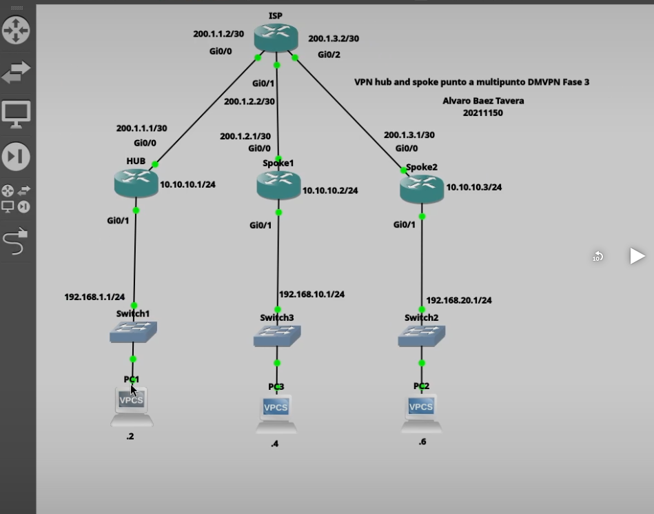
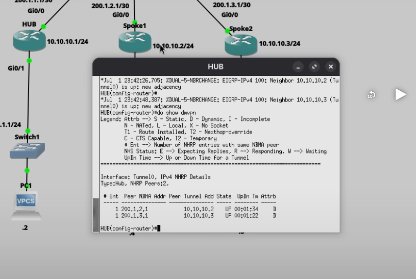
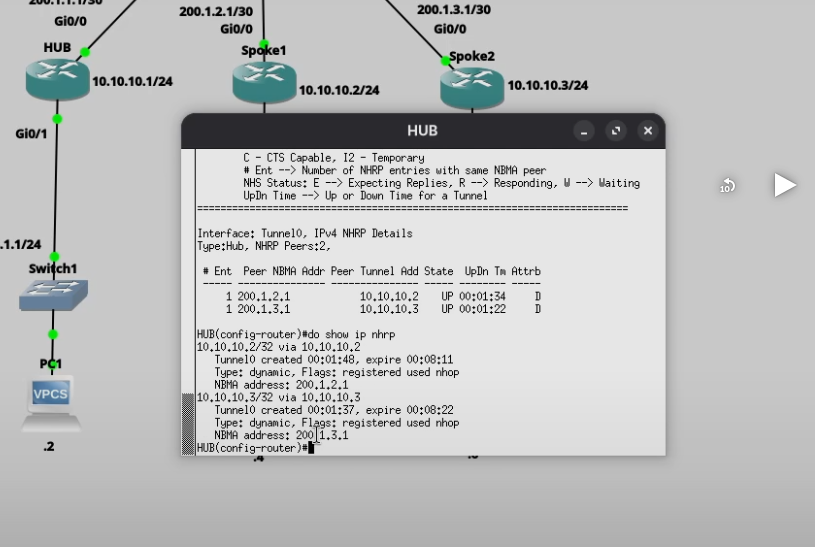
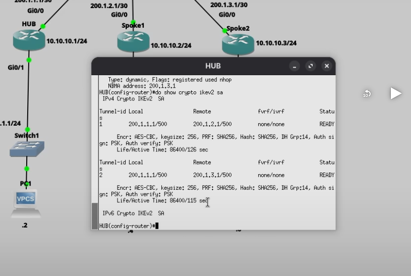
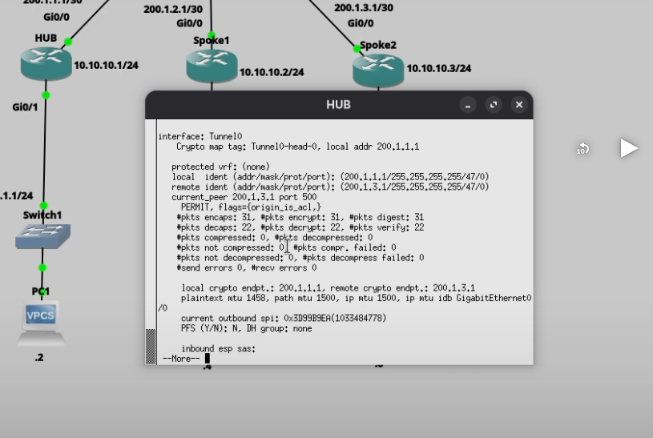
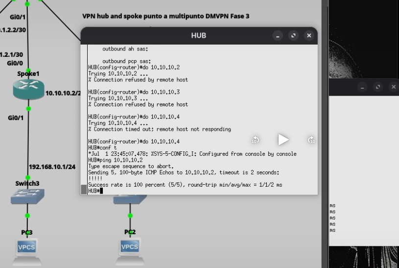
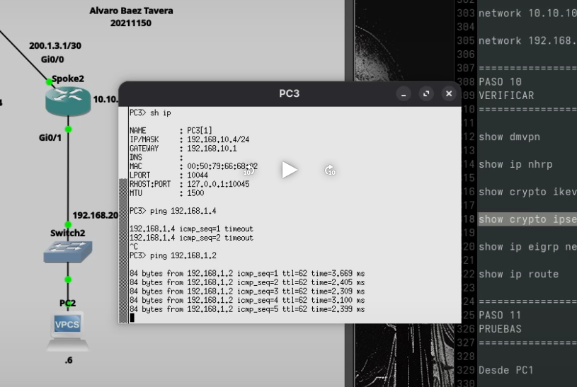

# VPN Hub and Spoke Punto a Multipunto DMVPN Fase 3 (IKEv2)

## Descripción

En esta práctica se implementó una VPN DMVPN (Dynamic Multipoint VPN) Fase 3 utilizando IKEv2 e IPSec. La topología está compuesta por un router Hub y dos routers Spoke conectados mediante un router ISP. DMVPN Fase 3 permite la comunicación directa entre los Spokes mediante redirección NHRP, reduciendo el tráfico que pasa por el Hub y optimizando el rendimiento de la red.

---

# Objetivo

Implementar una VPN Hub and Spoke Punto a Multipunto DMVPN Fase 3 utilizando IPSec IKEv2 y enrutamiento dinámico, permitiendo la comunicación segura entre todas las redes LAN y el establecimiento dinámico de túneles entre los Spokes.

---

# Topología



La topología está compuesta por:

- Router HUB
- Router Spoke1
- Router Spoke2
- Router ISP
- Switch LAN HUB
- Switch LAN Spoke1
- Switch LAN Spoke2
- PC1
- PC2
- PC3

---

# Direccionamiento IP

## HUB

| Interfaz | Dirección |
|----------|-----------|
| GigabitEthernet0/0 | 200.1.1.1/30 |
| GigabitEthernet0/1 | 192.168.1.1/24 |
| Tunnel0 | 10.10.10.1/24 |

---

## Spoke1

| Interfaz | Dirección |
|----------|-----------|
| GigabitEthernet0/0 | 200.1.2.1/30 |
| GigabitEthernet0/1 | 192.168.10.1/24 |
| Tunnel0 | 10.10.10.2/24 |

---

## Spoke2

| Interfaz | Dirección |
|----------|-----------|
| GigabitEthernet0/0 | 200.1.3.1/30 |
| GigabitEthernet0/1 | 192.168.20.1/24 |
| Tunnel0 | 10.10.10.3/24 |

---

## ISP

| Interfaz | Dirección |
|----------|-----------|
| GigabitEthernet0/0 | 200.1.1.2/30 |
| GigabitEthernet0/1 | 200.1.2.2/30 |
| GigabitEthernet0/2 | 200.1.3.2/30 |

---

## Equipos finales

### PC1

IP: 192.168.1.2/24

Gateway: 192.168.1.1

### PC3

IP: 192.168.10.4/24

Gateway: 192.168.10.1

### PC2

IP: 192.168.20.6/24

Gateway: 192.168.20.1

---

# Parámetros utilizados

| Parámetro | Valor |
|-----------|-------|
| Tipo VPN | DMVPN Fase 3 |
| IKE | Version 2 |
| Encriptación | AES-256-CBC |
| Integridad | SHA-256 |
| PRF | SHA-256 |
| Grupo Diffie-Hellman | 14 |
| Autenticación | Pre-Shared Key |
| Protocolo | NHRP |
| Enrutamiento | EIGRP |
| Tunnel | GRE Multipunto |
| IPSec | ESP |

---

# Configuración

La configuración completa utilizada durante la práctica se encuentra incluida dentro del repositorio en los scripts correspondientes de:

- HUB
- Spoke1
- Spoke2
- ISP

---

# Funcionamiento

DMVPN Fase 3 utiliza un modelo Hub and Spoke donde inicialmente todo el tráfico pasa por el Hub. Una vez aprendidas las rutas mediante EIGRP y resueltas las direcciones mediante NHRP, los Spokes establecen túneles directos entre ellos, evitando que el tráfico continúe pasando por el Hub.

El túnel GRE multipunto permite encapsular el tráfico mientras que IPSec proporciona confidencialidad, integridad y autenticación utilizando IKEv2.

---

# Evidencias

## Topología


Topología utilizada durante la implementación de la práctica.

---

## Estado de DMVPN



Se verifica mediante el comando:

```bash
show dmvpn
```

Se observa que ambos Spokes aparecen registrados dinámicamente en el Hub con estado **UP**.

---

## Registro NHRP



Se verifica mediante:

```bash
show ip nhrp
```

La salida confirma que los Spokes fueron registrados correctamente mediante NHRP y poseen sus correspondientes direcciones NBMA.

---

## Asociación IKEv2



Comando utilizado:

```bash
show crypto ikev2 sa
```

Se observan las asociaciones IKEv2 en estado **READY**, indicando que la negociación fue exitosa.

---

## Asociación IPSec



Comando utilizado:

```bash
show crypto ipsec sa
```

Los contadores de paquetes encapsulados y desencapsulados demuestran que existe tráfico cifrado atravesando los túneles IPSec.

---

## Conectividad del túnel



Se realizó un ping desde el HUB hacia las direcciones del túnel:

- 10.10.10.2
- 10.10.10.3

Ambos túneles respondieron correctamente, validando la conectividad entre los nodos DMVPN.

---

## Comunicación entre LANs



Se verificó la comunicación entre las redes LAN realizando un ping desde la PC3 (192.168.10.4) hacia la PC1 (192.168.1.2), comprobando el correcto funcionamiento de la VPN DMVPN Fase 3.

---

# Comandos de verificación

Durante la práctica se utilizaron los siguientes comandos para validar el funcionamiento de la VPN:

```bash
show dmvpn

show ip nhrp

show crypto ikev2 sa

show crypto ipsec sa

show ip route

show ip eigrp neighbors
```

---

# Video demostrativo

La demostración completa del funcionamiento de la práctica puede visualizarse en:

https://youtu.be/fiKhzVATtwc

---

# Autor

**Alvaro Baez Tavera**

**Matrícula:** 20211150

**Instituto Tecnológico de las Américas (ITLA)**

**Carrera:** Tecnólogo en Ciberseguridad
